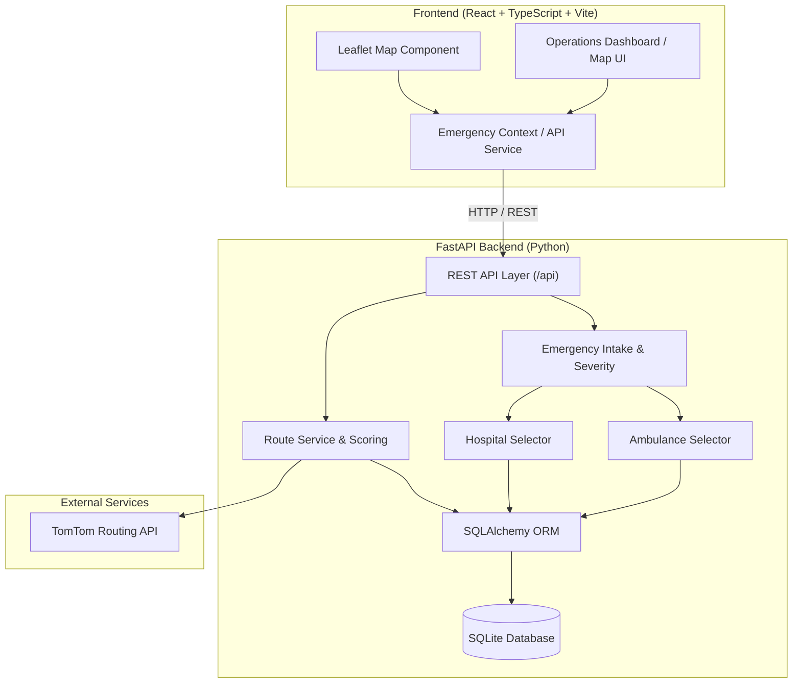

# RapidRoute AI

RapidRoute AI is an intelligent emergency response decision and routing platform. It automates emergency intake, severity assessment, ambulance dispatch, hospital allocation, and traffic-aware candidate route scoring with dynamic rerouting.

---

## Overview

In emergency medical dispatch, every second counts. Traditional manual dispatching often relies on fixed geographic zones or static distance estimations, which fail to account for hospital capability constraints, ambulance availability, or live traffic delays.

RapidRoute AI addresses these challenges through a unified decision pipeline:
1. **Emergency Intake & Severity Assessment**: Receives incoming emergency requests and classifies severity (`critical`, `high`, `medium`, `low`).
2. **Ambulance Selection**: Ranks available ambulances based on geographic proximity (Haversine distance) and estimated time of arrival (ETA).
3. **Hospital Selection**: Filters hospitals by emergency capabilities (e.g., cardiac, trauma, stroke), bed availability, and computes capacity-adjusted response scores.
4. **Traffic-Aware Route Calculation**: Computes live driving routes using the TomTom Routing API.
5. **Candidate Route Comparison**: Requests multiple alternative route candidates and ranks them using a normalized scoring model.
6. **Dynamic Rerouting**: Continuously monitors traffic condition changes and updates active routes in-place when a meaningful time saving (≥ 2 minutes) is detected.

---

## Key Features

- **Automated Dispatch Pipeline**: One-click creation of emergencies with simultaneous ambulance assignment and target hospital selection.
- **Capability-Based Matching**: Matches emergency medical needs (cardiac, trauma, stroke) against hospital specialization and available bed capacity.
- **TomTom Routing Engine**: Real-time traffic integration and multi-candidate alternative route calculation via TomTom Routing API.
- **Multi-Factor Candidate Scoring**: Ranks candidate routes using normalized ETA (70%) and distance (30%) weighting.
- **Dynamic In-Transit Rerouting**: Evaluates fresh route candidates for active ambulances and applies reroutes when meaningful time savings are found.
- **Interactive Operations Dashboard**: React frontend featuring Leaflet map visualizations for active emergency locations, hospital markers, ambulance markers, and multi-candidate route polylines.

---

## System Architecture

RapidRoute AI uses a decoupled client-server architecture. The FastAPI backend owns all decision logic, spatial scoring, database persistence, and external routing integration, while the React frontend handles presentation and user interaction.



---

## Technology Stack

### Backend
- **Python 3.13+**: Core application language.
- **FastAPI**: Asynchronous high-performance Web API framework.
- **Pydantic**: Data validation and request/response schema serialization.
- **SQLAlchemy**: Relational ORM for database operations.
- **SQLite**: Local relational database engine (`backend/rapidroute.db`).
- **Starlette**: Built-in configuration management for `.env` loading.
- **pytest**: Automated unit and integration testing suite.

### Frontend
- **React 18**: UI component framework.
- **TypeScript**: Type-safe client-side application logic.
- **Vite**: Modern frontend build tool and dev server.
- **Tailwind CSS**: Utility-first CSS styling framework.
- **Leaflet & React-Leaflet**: Interactive geospatial map rendering.
- **Lucide React**: UI Icon library.

### External Services
- **TomTom Routing API**: Live traffic-aware driving route computation and alternative route generation.

---

## Project Structure

```
rapidroute-ai/
├── backend/
│   ├── api/                  # FastAPI API route handlers
│   │   ├── ambulances.py     # Ambulance read endpoints
│   │   ├── emergencies.py    # Emergency intake & dispatch endpoints
│   │   ├── hospitals.py      # Hospital capacity read endpoints
│   │   └── routes.py         # Route calculation, candidates & rerouting
│   ├── database/             # Database initialization & seed scripts
│   │   ├── database.py       # SQLAlchemy engine & session setup
│   │   ├── init_db.py        # Table creation schema setup
│   │   └── seed.py           # Seed data generator for testing/demo
│   ├── dispatch/             # Dispatch decision logic
│   │   ├── ambulance_selector.py # Proximity & ETA ambulance selection
│   │   └── severity.py       # Emergency severity normalization & priority
│   ├── hospital/             # Hospital allocation logic
│   │   └── hospital_selector.py  # Capability & capacity matching
│   ├── models/               # SQLAlchemy ORM database models
│   │   ├── ambulance.py
│   │   ├── emergency.py
│   │   ├── hospital.py
│   │   └── route.py
│   ├── routing/              # Route calculation & scoring abstraction
│   │   ├── provider.py       # RouteProvider protocol & dataclasses
│   │   ├── google_routes.py  # Legacy Google provider (kept as fallback)
│   │   ├── route_scoring.py  # Multi-candidate route ranking (ETA 70%, Dist 30%)
│   │   └── tomtom_routes.py  # Live TomTom Routing API provider
│   ├── schemas/              # Pydantic schemas for API request/response
│   ├── services/             # Core application domain services
│   │   └── route_service.py  # Route generation, candidate scoring & rerouting
│   ├── tests/                # Test suite (111 passing tests)
│   ├── config.py             # App configuration & environment loader
│   ├── main.py               # FastAPI application entrypoint & CORS setup
│   └── requirements.txt      # Python dependencies list
├── frontend/
│   ├── src/
│   │   ├── components/       # UI components (Map, Header, Panels, Actions)
│   │   ├── context/          # React EmergencyContext operational state
│   │   ├── services/         # API client & backend data adapters
│   │   └── types/            # TypeScript interfaces & types
│   ├── index.html            # HTML entrypoint
│   ├── package.json          # Node dependencies & npm scripts
│   ├── tailwind.config.js    # Tailwind configuration
│   └── vite.config.ts        # Vite dev server configuration
├── .env.example              # Example environment variable template
├── .env                      # Local secret configuration (git-ignored)
└── README.md                 # Project documentation
```

---

## Backend API Endpoints

### System Health
| Method | Endpoint | Description |
| :--- | :--- | :--- |
| `GET` | `/health` | Returns backend health status `{"status": "ok"}`. |

### Emergency Management
| Method | Endpoint | Description | Request / Response Summary |
| :--- | :--- | :--- | :--- |
| `GET` | `/api/emergencies` | List all emergencies. | Returns array of emergency records. |
| `GET` | `/api/emergencies/{id}` | Fetch emergency by ID. | Returns specific emergency record. |
| `POST` | `/api/emergencies` | Create emergency & trigger dispatch. | Request: `{ type, severity, latitude, longitude }`<br>Response: Created emergency with assigned `ambulanceId` & `hospitalId`. |

### Ambulances & Hospitals
| Method | Endpoint | Description | Request / Response Summary |
| :--- | :--- | :--- | :--- |
| `GET` | `/api/ambulances` | List all ambulances. | Returns list of ambulances with status, location, and assigned emergency. |
| `GET` | `/api/ambulances/{id}` | Fetch ambulance details. | Returns single ambulance details. |
| `GET` | `/api/hospitals` | List all hospitals. | Returns list of hospitals with bed availability and medical capabilities. |
| `GET` | `/api/hospitals/{id}` | Fetch hospital details. | Returns single hospital details. |

### Route Operations
| Method | Endpoint | Description | Request / Response Summary |
| :--- | :--- | :--- | :--- |
| `POST` | `/api/routes` | Calculate, rank, and persist best route. | Request: `{ ambulanceId, emergencyId }`<br>Response: Created `Route` model with coordinates, distance, ETA, and traffic level. |
| `POST` | `/api/routes/candidates` | Preview candidate routes without persisting. | Request: `{ ambulanceId, emergencyId }`<br>Response: Array of scored route candidates ranked by score. |
| `POST` | `/api/routes/reroute` | Evaluate live traffic rerouting for active route. | Request: `{ ambulanceId, currentRouteId }`<br>Response: `RerouteResponse` with `timeSavedMinutes`, `reason`, and updated coordinates. |

---

## Routing and Decision Logic

### 1. Severity Priority
Severity levels dictate dispatch priority:
- `critical` (Priority 4)
- `high` (Priority 3)
- `medium` (Priority 2)
- `low` (Priority 1)

### 2. Ambulance Selection
When an emergency is created, available ambulances (`status == 'available'`) are evaluated using Haversine distance and estimated transit time:
$$\text{Score} = 0.60 \times \text{ETA (min)} + 0.40 \times \text{Distance (km)}$$
The available ambulance with the lowest score is selected and assigned to the emergency.

### 3. Hospital Selection
Hospitals are filtered by capability requirements based on emergency type:
- `cardiac` → requires `cardiac` capability
- `trauma` → requires `trauma` capability
- `stroke` → requires `stroke` capability
- `other` → no specific capability requirement

Eligible hospitals must have `emergencyAvailable == True` and `availableBeds > 0`. Eligible hospitals are ranked by:
$$\text{Score} = 0.50 \times \text{ETA (min)} + 0.30 \times \text{Distance (km)} + 0.20 \times \left(1 - \frac{\text{AvailableBeds}}{\text{MaxBeds}}\right)$$
The hospital with the lowest score is allocated as the destination hospital.

### 4. Route Candidate Scoring
When routes are requested, the TomTom Routing API returns multiple route candidates. The candidates are normalized and scored:
$$\text{Total Score} = 0.70 \times \text{Normalized ETA} + 0.30 \times \text{Normalized Distance}$$
- **ETA Weight**: 70% (Primary factor for emergency response)
- **Distance Weight**: 30% (Secondary factor)
- Lower score indicates a better route. The candidate ranked #1 is selected as the primary active route.

### 5. Dynamic Rerouting
During transit, rerouting can be simulated or triggered. Fresh traffic-aware candidates are requested from TomTom:
- If new route ETA is faster than the current route ETA by **≥ 2.0 minutes** (`MIN_REROUTE_SAVINGS_MINUTES`), the active route is updated in-place with new coordinates and ETA.
- If savings are `< 2.0 minutes`, the reroute is rejected (`reason: "No meaningful ETA improvement"`), leaving the active route unchanged.

---

## TomTom Integration

RapidRoute AI uses TomTom's Driving Routing API for live routing:
- **Endpoint**: `https://api.tomtom.com/routing/1/calculateRoute/{locations}/json`
- **Traffic Consideration**: `traffic=true` enables real-time traffic speeds and congestion delays.
- **Alternative Routes**: `maxAlternatives=2` requests alternative candidate paths.
- **Security**: The `TOMTOM_API_KEY` is kept strictly backend-side and read via `backend/config.py`. It is never exposed to the frontend or bundled into Vite scripts.

---

## Environment Variables

### Backend Configuration (`.env`)
Create a `.env` file in the project root directory:

```env
# TomTom Routing API Key (Backend Only - Secret)
TOMTOM_API_KEY=your_actual_key_here

# Allowed CORS Origins (Optional, default: http://localhost:5173)
CORS_ORIGINS=http://localhost:5173
```

### Frontend Configuration (`frontend/.env.local`)
Create a `.env.local` file in the `frontend/` directory:

```env
# API Base URL for Vite development server
VITE_API_URL=http://localhost:8000/api
```

---

## Local Development Setup

### Prerequisites
- Python 3.10+ (Python 3.13 recommended)
- Node.js 18+ and npm

### 1. Backend Setup (Windows PowerShell)

From the project root (`rapidroute-ai`):

```powershell
# Create Python virtual environment
python -m venv venv

# Activate virtual environment
.\venv\Scripts\Activate.ps1

# Install backend dependencies
pip install -r backend/requirements.txt

# Initialize and seed SQLite database with initial data
python -m backend.database.seed

# Start FastAPI dev server with auto-reload
uvicorn backend.main:app --reload --port 8000
```
The FastAPI backend will run at `http://localhost:8000`. Interactive API documentation (Swagger UI) is accessible at `http://localhost:8000/docs`.

### 2. Frontend Setup (Windows PowerShell)

Open a new PowerShell terminal and navigate to `frontend`:

```powershell
# Navigate to frontend folder
cd frontend

# Install Node dependencies
npm install

# Start Vite development server
npm run dev
```
The React frontend dashboard will run at `http://localhost:5173`.

---

## Testing

The backend includes a comprehensive `pytest` test suite with 100% mocked external HTTP calls.

To run the test suite from the project root:

```powershell
python -m pytest -q
```

### Test Coverage Summary (111 Tests Passing)
- `test_config.py`: Environment variable loading and configuration checks.
- `test_tomtom_routes.py`: TomTom response parsing, alternative routes, traffic query strings, and error handling.
- `test_google_routes.py`: Legacy Google provider unit test suite.
- `test_ambulance_selector.py`: Distance, ETA, and ambulance selection ranking.
- `test_hospital_selector.py`: Capability matching and bed capacity penalty scoring.
- `test_create_emergency.py`: Emergency creation and dispatch pipeline validation.
- `test_route_api.py`: Route creation, candidate ranking API, and reroute endpoints.
- `test_e2e_workflow.py`: End-to-end emergency lifecycle integration tests.
- `test_api_contract_audit.py`: Schema and field contract audit tests.

---

## Demo Workflow

To demonstrate the full system workflow in the application:

1. **Intake Emergency**: Click **"Report Cardiac Emergency"** or **"Report Trauma Emergency"** in the dashboard panel.
2. **Automated Dispatch**: The backend evaluates available ambulances and hospital capabilities, assigning an ambulance (e.g. `A101`) and hospital (e.g. `H001`).
3. **View Candidate Routes**: Click **"View Route Candidates"**. The backend requests live driving candidates from TomTom, ranks them by score, and displays alternative polylines on the map.
4. **Create Active Route**: Click **"Select Best Route"**. The #1 ranked candidate is persisted to the database, updating the ambulance status to `en_route`.
5. **Simulate Traffic Incident & Reroute**: Click **"Simulate Traffic Incident / Evaluate Reroute"**. The system fetches fresh traffic candidates and updates the route in-place if ETA savings exceed 2 minutes.

---

## Security Notes

- **Secret Management**: Never commit `.env` or real API keys to version control. The `.env` file is included in `.gitignore`.
- **Backend Key Isolation**: `TOMTOM_API_KEY` is loaded strictly inside Python server code and is never returned in REST responses or passed to frontend variables.
- **Vite Variable Scope**: Frontend variables prefixed with `VITE_` (e.g., `VITE_API_URL`) are bundled into client-side JavaScript and must only contain public URLs, never private API keys.

---

## Deployment Overview

- **Backend**: Can be deployed to services like Render, Railway, AWS ECS, or DigitalOcean App Platform using Uvicorn or Gunicorn. Configure `TOMTOM_API_KEY` and `CORS_ORIGINS` in the hosting environment variables.
- **Frontend**: Can be built using `npm run build` and hosted on static platforms like Vercel, Netlify, or Cloudflare Pages. Set `VITE_API_URL` to point to the production backend API URL.

---

## Current Limitations & Future Improvements

- **Database Migration**: Currently uses SQLite (`backend/rapidroute.db`) for local development; production deployments can migrate to PostgreSQL with PostGIS extensions.
- **Authentication**: User roles (dispatchers, ambulance drivers, hospital staff) can be added using JWT-based authentication.
- **Real-Time Telemetry**: Real-time GPS location streaming from ambulances can be integrated using WebSockets or Server-Sent Events (SSE).
- **ML ETA Prediction**: Historical dispatch performance data can be trained to refine local road travel speeds beyond standard traffic API estimates.

---

## License

This repository currently has no explicit open-source license. All rights reserved.
